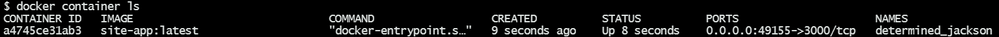
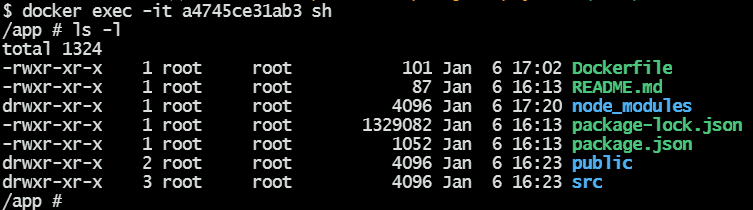

# My Personal Portfolio Website

You can visit [Here](https://abhishekpawl.vercel.app/)

# Docker utility:

## To run the dockerized container of this app:

After cloning the repo:

* In the root directory:
  1. To build the image from the Dockerfile, run
      ```
      docker image build --tag <IMAGE-NAME>:<tagname> .
      ```
  1. To run a docker container of the image and to:
    1. keep STDIN open even if not attached
    1. provide a tty
    1. run the container in detached mode
    1. publish the exported ports (since it has been provided for in the Dockerfile), run
      ```
      docker container run -i -t -d -P <IMAGE-NAME>:<tagname>
      ```
  1. To retrieve the ID of the docker container, run
      ```
      docker container ls
      ```
      
  1. To get into the container and the filesystem in interactive mode, run
      ```
      docker exec -it <CONTAINER-ID> sh
      ```
      
  1. To stop and remove the container at once, run
      ```
      docker container rm -f <CONTAINER ID>
      ```

